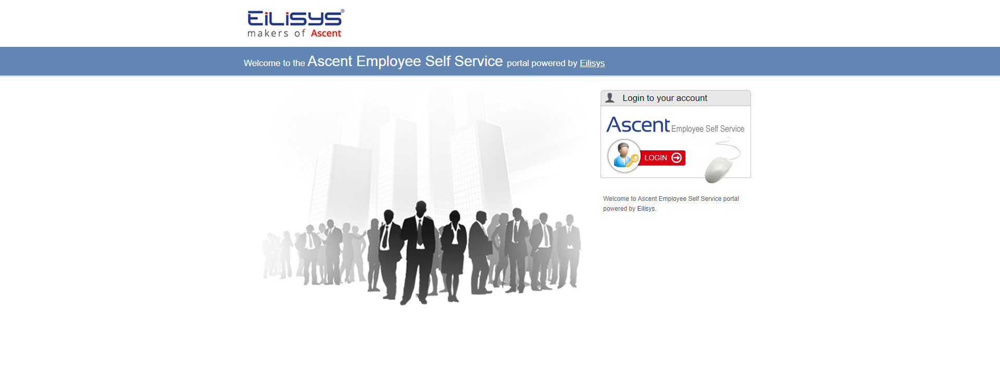
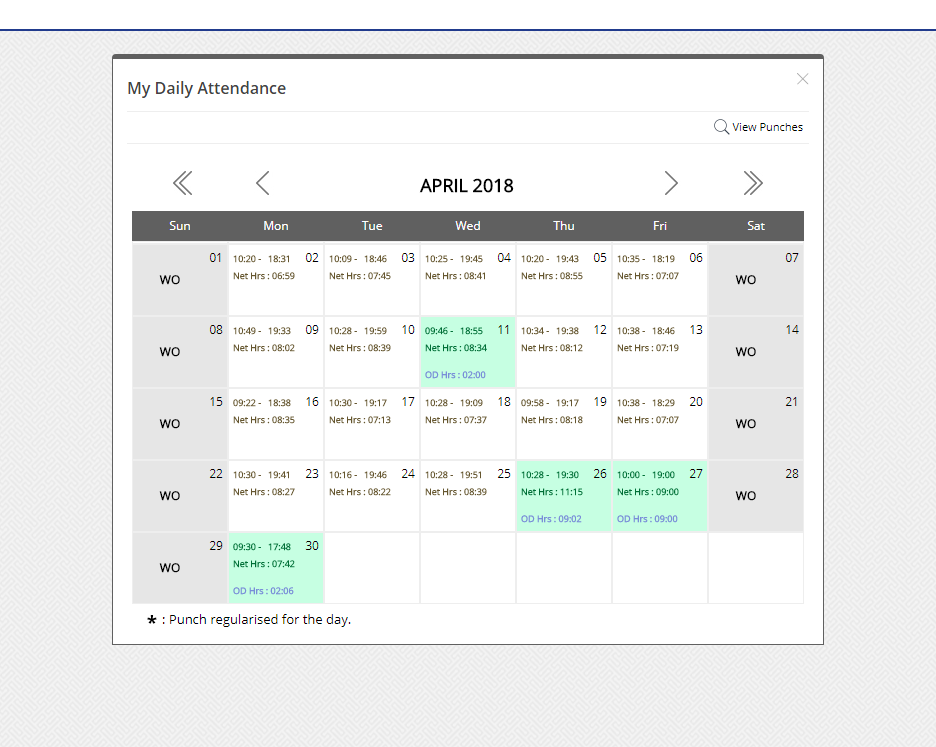

# CalcHours

## Angular 4 & Electron Framework
Initially Developed as Angular 4 WebApp, then used electron to build cross platform desktop app.

## Description
Simple Utility of text process of data from Eilisys Ascent Payroll system.
1. Just Copy Your Ascent Monthly Data from calender
2. Calculates Your Work Hours on basis of info you paste
3. Shows the Diffrence
4. Helpful enough huh ?

## Sample Screens

## Development server
1. Git Clone
2. npm install
3. ng serve

## Build

Run `ng build` to build the project. The build artifacts will be stored in the `dist/` directory. Use the `-prod` flag for a production build.

### for Electron Refer https://www.christianengvall.se/electron-packager-tutorial/
